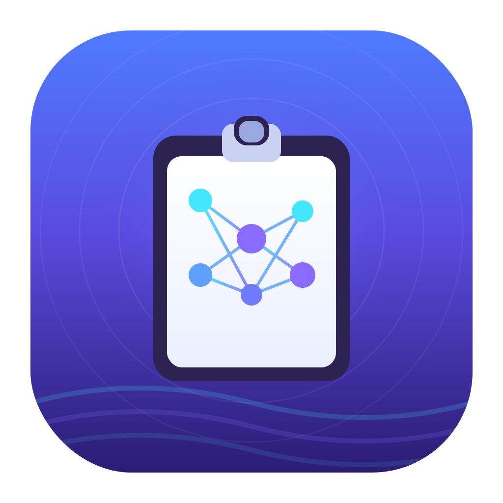

<p align="center">
  
</p>

<h1 align="center">CacheMind</h1>

<p align="center">
  A smart clipboard manager for macOS that goes beyond simple copy-paste.
</p>

<p align="center">
  Built with SwiftUI and Swift Package Manager, CacheMind understands your clipboard content with optional AI-powered intelligence. Lives in your menu bar, stays out of your way.
</p>

## Features

- **Clipboard Monitoring** — Automatic capture of text, images, URLs, terminal commands, and code snippets with configurable polling interval
- **Smart Classification** — Rule-based + optional AI-powered categorization (text, URL, terminal, code)
- **URL Domain Grouping** — Automatically extracts and groups URLs by domain
- **Pin & Collect** — Pin important items so they survive cleanup
- **AI-Powered Enhancements** (optional, all toggleable):
  - Semantic search via embedding vectors (cosine similarity)
  - Smart classification using LLM
  - Auto-generated titles and summaries
  - Intent recognition (links, dates, emails → action suggestions)
  - Format cleaning (normalize whitespace, code indentation)
  - Smart dedup (edit distance + embedding similarity, configurable threshold)
  - Smart convert (Markdown ↔ plain text, JSON formatting, URL decode, Base64)
- **Multiple AI Backends** — OpenAI-compatible APIs (OpenAI, local servers, etc.), llama.cpp server, or Ollama — all through a unified interface
- **Global Hotkey** — Summon from anywhere, configurable key combo
- **Quick Panel** — Floating overlay for fast paste without switching apps
- **Auto-Paste** — Paste directly into the previous app via simulated ⌘V
- **Import / Export** — Full backup and restore via JSON
- **Launch at Login** — Optional, using `SMAppService`
- **Menu Bar Only** — No Dock icon, minimal footprint

## Requirements

- macOS 13 Ventura or later
- Apple Silicon (arm64) or Intel

## Build

```bash
git clone https://github.com/SpaceSeriesSirin/CacheMind.git
cd CacheMind
swift build
swift run
```

## Package as .app

```bash
./scripts/package.sh
open CacheMind.app
```

This builds a release binary, assembles a `.app` bundle with an auto-generated icon, and ad-hoc signs it.

## Project Structure

```
CacheMind/
├── Package.swift
├── Sources/
│   ├── App/           # @main entry, AppDelegate, menu bar
│   ├── Models/        # ClipboardItem, Setting, ActionSuggestion
│   ├── Database/      # GRDB migrations, repositories
│   ├── Services/      # ClipboardMonitor, Hotkey, AutoPaste, Import/Export
│   ├── AI/            # Embedding, providers, similarity, format cleaning
│   ├── Views/         # SwiftUI views (sidebar, list, detail, settings)
│   └── Utils/         # Extensions, image helpers, logging
├── Resources/         # Info.plist
├── Tests/             # Unit tests
└── scripts/           # Build & icon generation
```

## Configuration

All settings are stored in a local SQLite database at `~/Library/Application Support/CacheMind/`. No cloud sync, no telemetry.

AI features are **off by default**. Enable them in Settings → AI and point to your preferred backend:

| Provider | Default Endpoint | Notes |
|----------|-----------------|-------|
| OpenAI Compatible | `https://api.openai.com` | Any OpenAI-compatible API (OpenAI, local servers, etc.) |
| llama.cpp | `http://localhost:8080` | Run `llama-server` locally |
| Ollama | `http://localhost:11434` | Run `ollama serve` locally |

## Dependencies

- [GRDB.swift](https://github.com/groue/GRDB.swift) 6.x — SQLite toolkit for Swift

## License

MIT — see [LICENSE](LICENSE).
